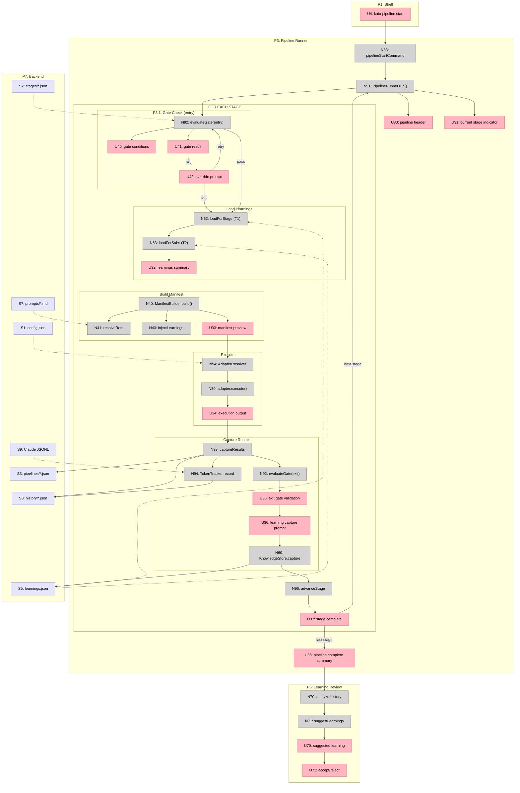

# kata — Breadboard

## Context

**Product**: kata — a Development Methodology Engine (TypeScript library + CLI)
**Shape**: A (selected) — 9 parts (A1–A9)
**Pipeline**: 20260221-methodology-engine
**Input**: `shaping.md` (Shape A), `frame.md` (problem/outcome), spike resolutions (S1–S6)

### Adaptation for CLI

kata is a library + CLI, not a web application. Breadboarding conventions adapt:

| Web Concept | kata Equivalent |
|-------------|-----------------|
| Page/Route | CLI command session (interactive) or command output (non-interactive) |
| Modal (blocking) | Interactive prompt sequence (must answer before returning to shell) |
| Button click | Command invocation or prompt selection |
| Rendered display | Formatted terminal output (tables, status, JSON) |
| Backend/API | `.kata/` file system + domain services |

The **blocking test** still applies: while in `kata init` prompts, you cannot run
`kata pipeline start`. Interactive sessions are Places. Non-interactive commands
(print-and-return) are affordances within the Shell place.

### Thematic CLI Naming (D17)

CLI command names use kata/martial arts vocabulary where it maps naturally, while
remaining immediately intuitive to someone unfamiliar with the metaphor:

| Domain Concept | Thematic Name | CLI Command | Why It Works |
|----------------|---------------|-------------|--------------|
| Stage | **form** | `kata form list` | A form is a single move in a kata — atomic, practiced, composable |
| Pipeline | **sequence** | `kata sequence start` | A sequence is an ordered set of forms — exactly what a pipeline is |
| Cycle | **practice** | `kata practice new` | A practice session is time/budget-bounded repetition — Shape Up betting |
| Bet | **focus** | `kata practice focus` | Each bet focuses attention within a practice — clear without metaphor |
| Cooldown | **reflect** | `kata reflect` | Reflection after practice — universally understood |
| Knowledge | **memory** | `kata memory query` | Muscle memory from repeated practice — intuitive |
| Init | **begin** | `kata begin` | "Begin your kata" — poetic but obvious |

**Fallback principle**: If a thematic name would confuse, use the plain name. The theme
enhances recognition, never obscures meaning. All commands also accept `--help`.

The full methodology is itself a kata — a choreographed sequence of forms, practiced
repeatedly across cycles, refined through accumulated memory. Using `kata` isn't just
a package name; it's the conceptual frame for the entire CLI vocabulary.

---

## Places

| # | Place | Description |
|---|-------|-------------|
| P1 | Shell | Terminal idle — user invokes any kata command. Non-interactive commands execute and return here. |
| P2 | Init Wizard | `kata init` — multi-step interactive setup. Detects project state, prompts for config, creates `.kata/` directory. |
| P3 | Pipeline Runner | `kata pipeline start <type>` — stage-by-stage traversal with gate checks, manifest building, execution handoff, and learning capture. |
| P3.1 | Gate Check | Subplace within P3: gate evaluation with pass/fail display and override prompt (retry / skip / abort). |
| P4 | Cycle Wizard | `kata cycle new` — budget prompts, bet entry, appetite allocation, dependency check. Also entered via `kata cycle bet`. |
| P5 | Cooldown Session | `kata cycle cooldown` — end-of-cycle retrospective, bet outcome review, next-cycle proposal. |
| P6 | Learning Review | Post-pipeline self-improvement — displays suggested learnings and prompt updates, user accepts/rejects each. |
| P7 | Backend | `.kata/` file system — JSON persistence for config, stages, pipelines, cycles, knowledge, history. |

---

## UI Affordances

### P1: Shell (non-interactive commands)

| # | Place | Component | Affordance | Control | Wires Out | Returns To |
|---|-------|-----------|------------|---------|-----------|------------|
| U1 | P1 | cli | `kata init` | type | → P2 | — |
| U2 | P1 | cli | `kata stage list` output | render | — | — |
| U3 | P1 | cli | `kata stage inspect <type>` output | render | — | — |
| U4 | P1 | cli | `kata pipeline start <type>` | type | → P3 | — |
| U5 | P1 | cli | `kata pipeline status [id]` output | render | — | — |
| U6 | P1 | cli | `kata pipeline define <stages...>` output | type | → N20 | — |
| U7 | P1 | cli | `kata cycle new` | type | → P4 | — |
| U8 | P1 | cli | `kata cycle status [id]` output | render | — | — |
| U9 | P1 | cli | `kata cycle bet <cycle-id>` | type | → P4 | — |
| U10 | P1 | cli | `kata cycle cooldown <cycle-id>` | type | → P5 | — |
| U11 | P1 | cli | `kata knowledge query [--stage X]` output | render | — | — |
| U12 | P1 | cli | `kata knowledge stats` output | render | — | — |

### P2: Init Wizard

| # | Place | Component | Affordance | Control | Wires Out | Returns To |
|---|-------|-----------|------------|---------|-----------|------------|
| U20 | P2 | init | project detection summary | render | — | — |
| U21 | P2 | init | methodology framework prompt | select | → N80 | — |
| U22 | P2 | init | execution adapter prompt | select | → N80 | — |
| U23 | P2 | init | pipeline templates confirmation | confirm | → N80 | — |
| U24 | P2 | init | init complete summary (files created, next steps) | render | → P1 | — |

### P3: Pipeline Runner

| # | Place | Component | Affordance | Control | Wires Out | Returns To |
|---|-------|-----------|------------|---------|-----------|------------|
| U30 | P3 | pipeline-runner | pipeline header (type, stage count, scope) | render | — | — |
| U31 | P3 | pipeline-runner | current stage indicator (N of M, type, flavor) | render | — | — |
| U32 | P3 | pipeline-runner | loaded learnings summary (Tier 1 + subscribed) | render | — | — |
| U33 | P3 | pipeline-runner | manifest preview (prompt excerpt, artifact schemas) | render | — | — |
| U34 | P3 | pipeline-runner | execution adapter output (launching / printing) | render | — | — |
| U35 | P3 | pipeline-runner | exit gate validation (artifacts found, schema status) | render | — | — |
| U36 | P3 | pipeline-runner | learning capture prompt (what worked / didn't) | type | → N60 | — |
| U37 | P3 | pipeline-runner | stage complete confirmation | render | → N96 | — |
| U38 | P3 | pipeline-runner | pipeline complete summary (artifacts, learnings, tokens) | render | → P6 | — |

### P3.1: Gate Check (subplace)

| # | Place | Component | Affordance | Control | Wires Out | Returns To |
|---|-------|-----------|------------|---------|-----------|------------|
| U40 | P3.1 | gate-check | gate conditions display | render | — | — |
| U41 | P3.1 | gate-check | gate result (pass / fail with details) | render | — | — |
| U42 | P3.1 | gate-check | override prompt (retry / skip / abort) | select | → N92 (retry), → N62 (skip), abort → P1 | — |

### P4: Cycle Wizard

| # | Place | Component | Affordance | Control | Wires Out | Returns To |
|---|-------|-----------|------------|---------|-----------|------------|
| U50 | P4 | cycle-wizard | budget prompt (tokens and/or time box) | type | → N30 | — |
| U51 | P4 | cycle-wizard | bet entry prompt (issue URL or description) | type | → N31 | — |
| U52 | P4 | cycle-wizard | appetite allocation prompt (% of budget) | type | → N31 | — |
| U53 | P4 | cycle-wizard | dependency check result (independent / warning) | render | — | — |
| U54 | P4 | cycle-wizard | "add another bet?" prompt | confirm | → U51 or P1 | — |
| U55 | P4 | cycle-wizard | cycle created summary (budget, bets, suggestions) | render | → P1 | — |

### P5: Cooldown Session

| # | Place | Component | Affordance | Control | Wires Out | Returns To |
|---|-------|-----------|------------|---------|-----------|------------|
| U60 | P5 | cooldown | cycle retrospective summary (completions, budget util) | render | — | — |
| U61 | P5 | cooldown | per-bet outcome review (complete / partial / abandoned) | render | — | — |
| U62 | P5 | cooldown | unblocked work display (what this cycle enables) | render | — | — |
| U63 | P5 | cooldown | next-cycle proposal (suggested bets from dep graph) | render | — | — |
| U64 | P5 | cooldown | cooldown complete confirmation | confirm | → P1 | — |

### P6: Learning Review

| # | Place | Component | Affordance | Control | Wires Out | Returns To |
|---|-------|-----------|------------|---------|-----------|------------|
| U70 | P6 | learning-review | suggested learning display (tier, category, evidence) | render | — | — |
| U71 | P6 | learning-review | accept / reject / edit learning prompt | select | → N60 or skip | — |
| U72 | P6 | learning-review | suggested prompt update (diff: old vs proposed) | render | — | — |
| U73 | P6 | learning-review | accept / reject prompt update | select | → N73 or skip | — |
| U74 | P6 | learning-review | review complete summary (accepted N learnings, M updates) | render | → P1 | — |

---

## Code Affordances

### A1: Core Domain Types (Zod Schemas)

These are validation schemas consumed by all other parts. Modeled as the type foundation
rather than individual affordances — they don't have independent wiring.

| Schema | Validates | Consumed By |
|--------|-----------|-------------|
| `StageSchema` | Stage definitions (type, flavor, gates, artifacts, prompt, hooks) | A2, A3, A5 |
| `PipelineSchema` | Pipeline definitions (stages[], metadata, state) | A3, A4 |
| `CycleSchema` | Cycle definitions (budget, bets[], pipelines[], state) | A4 |
| `GateSchema` | Gate conditions (conditions[], artifacts[], thresholds) | A3, A5 |
| `ArtifactSchema` | Artifact definitions (name, schema, required) | A1, A5 |
| `BetSchema` | Bet definitions (description, appetite, project ref, issue refs) | A4 |
| `LearningSchema` | Learning entries (tier, category, content, evidence, confidence) | A7, A8 |
| `ExecutionManifestSchema` | Manifest output (stage, prompt, context, gates, artifacts) | A5, A6 |

### A2: Stage Registry

| # | Place | Component | Affordance | Control | Wires Out | Returns To |
|---|-------|-----------|------------|---------|-----------|------------|
| N10 | P7 | StageRegistry | `register(stage)` | call | → S2 | — |
| N11 | P7 | StageRegistry | `get(type, flavor?)` | call | — | → N40, U3 |
| N12 | P7 | StageRegistry | `list(filter?)` | call | — | → U2 |
| N13 | P7 | StageRegistry | `loadBuiltins()` | call | → N10 | — |
| N14 | P7 | StageRegistry | `loadCustom(configPath)` | call | → N10, ← S2 | — |

### A3: Pipeline Composer

| # | Place | Component | Affordance | Control | Wires Out | Returns To |
|---|-------|-----------|------------|---------|-----------|------------|
| N20 | P7 | PipelineComposer | `define(stages[])` | call | → N21 | → N23 |
| N21 | P7 | PipelineComposer | `validate(pipeline)` — gate compat check | call | — | → N20 |
| N22 | P7 | PipelineComposer | `loadTemplates()` — built-in pipeline types | call | → S3 | — |
| N23 | P7 | PipelineComposer | `instantiate(template, context)` | call | → S3 | → N91 |

### A4: Cycle Manager

| # | Place | Component | Affordance | Control | Wires Out | Returns To |
|---|-------|-----------|------------|---------|-----------|------------|
| N30 | P7 | CycleManager | `create(budget)` | call | → S4 | → U55 |
| N31 | P7 | CycleManager | `addBet(cycleId, bet)` | call | → S4, → N34 | → U53 |
| N32 | P7 | CycleManager | `mapPipeline(betId, pipelineId)` | call | → S4 | — |
| N33 | P7 | CycleManager | `getBudgetStatus(cycleId)` | call | ← S4, ← S8 | → U8, U60 |
| N34 | P7 | CycleManager | `checkDependencies(cycleId)` | call | ← S4 | → U53 |
| N35 | P7 | CycleManager | `generateCooldown(cycleId)` | call | ← S4, ← S5, ← S8 | → U60–U63 |

### A5: Execution Manifest Builder

| # | Place | Component | Affordance | Control | Wires Out | Returns To |
|---|-------|-----------|------------|---------|-----------|------------|
| N40 | P7 | ManifestBuilder | `build(stage, context, learnings)` | call | → N41, → N42, → N43 | → N50 |
| N41 | P7 | ManifestBuilder | `resolveRefs(template)` — $ref → .md content | call | ← S7 | → N40 |
| N42 | P7 | ManifestBuilder | `attachGates(manifest, stage)` | call | — | → N40 |
| N43 | P7 | ManifestBuilder | `injectLearnings(manifest, learnings)` | call | — | → N40 |

### A6: Execution Adapter Interface

| # | Place | Component | Affordance | Control | Wires Out | Returns To |
|---|-------|-----------|------------|---------|-----------|------------|
| N50 | P7 | IExecutionAdapter | `execute(manifest)` — port interface | call | — | → N93 |
| N51 | P7 | ClaudeCliAdapter | `execute(manifest)` — spawns Claude CLI | call | → external | → N93 |
| N52 | P7 | ManualAdapter | `execute(manifest)` — prints instructions | call | → U34 | → N93 |
| N53 | P7 | ComposioAdapter | `execute(manifest)` — calls `ao spawn` | call | → external | → N93 |
| N54 | P7 | AdapterResolver | `resolve(config)` — resolves adapter from .kata/config | call | ← S1 | → N50 |

### A7: Knowledge Store

| # | Place | Component | Affordance | Control | Wires Out | Returns To |
|---|-------|-----------|------------|---------|-----------|------------|
| N60 | P7 | KnowledgeStore | `capture(stageType, learning)` | call | → S5 | — |
| N61 | P7 | KnowledgeStore | `query(filter)` | call | ← S5 | → U11 |
| N62 | P7 | KnowledgeStore | `loadForStage(stageType)` — Tier 1 | call | ← S5 | → N43 |
| N63 | P7 | KnowledgeStore | `loadForSubscriptions(agentId)` — Tier 2 | call | ← S5, ← S6 | → N43 |
| N64 | P7 | KnowledgeStore | `loadForAgent(agentId)` — Tier 3 | call | ← S5 | → N43 |
| N65 | P7 | KnowledgeStore | `subscribe(agentId, categories[])` | call | → S6 | — |
| N66 | P7 | KnowledgeStore | `stats()` | call | ← S5 | → U12 |

### A8: Self-Improving Loop

| # | Place | Component | Affordance | Control | Wires Out | Returns To |
|---|-------|-----------|------------|---------|-----------|------------|
| N70 | P7 | LearningExtractor | `analyze(history[])` — extract patterns | call | ← S8 | → N71 |
| N71 | P7 | LearningExtractor | `suggestLearnings(patterns)` | call | — | → U70 |
| N72 | P7 | LearningExtractor | `suggestPromptUpdates(learnings, stages)` | call | ← S2, ← S5 | → U72 |
| N73 | P7 | LearningExtractor | `apply(stageType, update)` — accepted update | call | → S2, → S7 | → U74 |

### A9: CLI + Pipeline Orchestration

| # | Place | Component | Affordance | Control | Wires Out | Returns To |
|---|-------|-----------|------------|---------|-----------|------------|
| N80 | P2 | initCommand | `handleInit()` — orchestrates project initialization | call | → N13, → N22, → S1 | → U20–U24 |
| N81 | P1 | stageListCommand | `kata stage list` | call | → N12 | → U2 |
| N82 | P1 | stageInspectCommand | `kata stage inspect` | call | → N11 | → U3 |
| N83 | P3 | pipelineStartCommand | `kata pipeline start [--practice <id> --focus <id>]` — launches runner | call | → N23, → N32 (if cycle args), → N91 | → U30 |
| N84 | P1 | pipelineStatusCommand | `kata pipeline status` | call | ← S3 | → U5 |
| N85 | P4 | cycleNewCommand | `kata cycle new` — launches wizard | call | → N30, → N31 | → U50–U55 |
| N86 | P1 | cycleStatusCommand | `kata cycle status` | call | → N33 | → U8 |
| N87 | P5 | cooldownCommand | `kata cycle cooldown` | call | → N35 | → U60–U64 |
| N88 | P1 | knowledgeQueryCommand | `kata knowledge query` | call | → N61 | → U11 |
| N89 | P1 | knowledgeStatsCommand | `kata knowledge stats` | call | → N66 | → U12 |
| N91 | P3 | PipelineRunner | `run(pipelineId)` — main traversal loop | call | → N92, → N62, → N40, → N54, → N50, → N93, → N60, → N96 | → U31–U38 |
| N92 | P3.1 | PipelineRunner | `evaluateGate(gate, context)` | call | ← S3 | → U40–U42 |
| N93 | P3 | PipelineRunner | `captureResults(stageId, results)` | call | → S3, → S8, → N94 | — |
| N94 | P7 | TokenTracker | `recordUsage(stageId, jsonlPath)` | call | ← S9, → S8 | — |
| N95 | P7 | TokenTracker | `checkBudget(cycleId)` | call | ← S4, ← S8 | → U38 (alerts) |
| N96 | P3 | PipelineRunner | `advanceStage(pipelineId)` | call | → S3 | → U31 (next stage) |

---

## Data Stores

| # | Place | Store | Description | Written By | Read By |
|---|-------|-------|-------------|------------|---------|
| S1 | P7 | `.kata/config.json` | Project config (methodology, adapter, paths) | N80 | N54, N91 |
| S2 | P7 | `.kata/stages/*.json` | Stage definitions (built-in + custom) | N10, N73 | N11, N12, N14, N72 |
| S3 | P7 | `.kata/pipelines/*.json` | Pipeline instances (state, current stage, artifacts) | N23, N93, N96 | N84, N91, N92 |
| S4 | P7 | `.kata/cycles/*.json` | Cycle definitions (budget, bets, pipeline mappings) | N30, N31, N32 | N33, N34, N35, N95 |
| S5 | P7 | `.kata/knowledge/learnings.json` | Learning entries (tiered: stage, category, agent) | N60 | N61, N62, N63, N64, N66, N72 |
| S6 | P7 | `.kata/knowledge/subscriptions.json` | Agent → category subscription mappings | N65 | N63 |
| S7 | P7 | `.kata/prompts/*.md` | Prompt template files ($ref targets) | N73 | N41 |
| S8 | P7 | `.kata/history/*.json` | Execution history (tokens, timing, artifacts per stage) | N93, N94 | N33, N70, N95 |
| S9 | P7 | `~/.claude/projects/*/*.jsonl` | Claude Code session files (external, read-only) | external | N94 |

---

## Scope Coverage

| Req | Requirement | Parts | Key Affordances | Covered? |
|-----|-------------|-------|-----------------|----------|
| R0 | Encode methodology as executable, composable stages | A1, A2 | N10–N14, S2, StageSchema | Yes |
| R1 | Stages have gates, artifacts, learning hooks | A1, A3, A5 | N40–N43, N92, GateSchema, ArtifactSchema | Yes |
| R2 | Pipelines are ordered compositions of stages | A3 | N20–N23, S3 | Yes |
| R3 | Cycles are budget-bounded compositions across projects | A4 | N30–N35, N94–N95, S4 | Yes |
| R4 | Self-improving knowledge system | A7, A8 | N60–N66, N70–N73, S5, S6 | Yes |
| R5 | Null-state onboarding | A2, A9 | N13, N22, N80, U20–U24 | Yes |
| R6 | Execution-layer agnostic | A5, A6 | N40, N50–N54, ExecutionManifestSchema | Yes |
| R7 | Dashboard/UI | — | Deferred (D15) — CLI output only for now | Deferred |
| R8 | JSON-first config with $ref | A1, A5 | N41, S1, S2, S7 | Yes |

---

## Core Flow: Pipeline Runner (P3)

The Pipeline Runner is the heart of kata — the orchestration loop that traverses stages,
evaluates gates, builds manifests, hands off execution, and captures learnings. This
diagram traces the flow through one stage iteration within `kata pipeline start`.



### Workflow Guide: One Stage Iteration

| Step | Action | Affordances |
|------|--------|-------------|
| **1** | User runs `kata pipeline start vertical` | U4 → N83 → N91 |
| **2** | Entry gate evaluated for current stage | N92e → U40, U41 |
| **3** | Gate fails → override prompt (retry/skip/abort) | U42 → N92e or skip |
| **4** | Load Tier 1 + subscribed Tier 2 learnings | N62, N63 ← S5 → U32 |
| **5** | Build execution manifest (resolve $ref, inject learnings) | N40, N41, N43 → U33 |
| **6** | Resolve adapter from config and execute | N54 ← S1 → N50 → U34 |
| **7** | Capture results + record token usage | N93 → S3, S8; N94 ← S9 → S8 |
| **8** | Validate exit gate (artifacts exist, schema valid) | N92x → U35 |
| **9** | Prompt for learning capture | U36 → N60 → S5 |
| **10** | Advance to next stage (or complete pipeline) | N96 → U37 → N91 (loop) or U38 |
| **11** | Post-pipeline: analyze history, suggest improvements | N70 ← S8 → N71 → U70, U71 |

---

## Vertical Slices

### Slice Summary

| # | Slice | Parts | Key Affordances | Demo |
|---|-------|-------|-----------------|------|
| V1 | Core types + Init scaffold | A1, A9 (partial) | StageSchema–ManifestSchema, N80, U20–U24, S1 | "Run `kata init`, see `.kata/` directory created with default config and 8 built-in stages" |
| V2 | Stage registry + CLI browsing | A2, A9 (partial) | N10–N14, N81–N82, U2–U3, S2 | "Run `kata stage list`, see 8 Shape Up stages. Inspect one to see gates, artifacts, prompt preview" |
| V3 | Pipeline composition + traversal | A3, A5, A9 (partial) | N20–N23, N40–N43, N83, N91–N92, N96, U30–U35, U37, S3, S7 | "Start a vertical pipeline, watch it traverse stages with gate checks and manifest generation" |
| V4 | Execution adapters | A6 | N50–N54, U34 | "Pipeline stage hands off to ManualAdapter (prints instructions) or ClaudeCliAdapter (opens Claude)" |
| V5 | Knowledge store + learning capture | A7, A9 (partial) | N60–N66, N88–N89, U11–U12, U32, U36, S5, S6 | "Complete a stage, capture a learning. Start next stage, see it auto-loaded as Tier 1 context" |
| V6 | Cycle management + budgets | A4, A9 (partial) | N30–N35, N85–N86, U7–U8, U50–U55, S4 | "Create a cycle with 2M token budget, add 3 bets with appetites, see budget allocation" |
| V7 | Token tracking + budget alerts | A4 (partial), A7 (partial) | N94–N95, U38, S8, S9 | "After pipeline run, see actual tokens consumed per stage. Budget alerts at 75/90/100%" |
| V8 | Self-improving loop | A8 | N70–N73, U70–U74, P6 | "After 3 pipeline runs, system suggests a Tier 1 learning with evidence. Accept → prompt template updated" |
| V9 | Cooldown + cycle proposals | A4 (partial), A9 (partial) | N35, N87, U10, U60–U64, P5 | "Run cooldown, see per-bet outcomes, budget utilization, and suggested bets for next cycle" |

### Slice Dependencies

```
V1 ──→ V2 ──→ V3 ──→ V4
                │       │
                ↓       ↓
               V5 ──→ V7
                │
                ↓
               V8

V1 ──→ V6 ──→ V7
        │
        ↓
       V9
```

- **V1** (types + init) unblocks everything
- **V2** (registry) requires V1 for schemas, unblocks V3
- **V3** (pipeline traversal) requires V2 for stage resolution, unblocks V4 and V5
- **V4** (adapters) requires V3 for manifest builder
- **V5** (knowledge) requires V3 for stage-exit hooks, unblocks V7 and V8
- **V6** (cycles) requires V1 for schemas, unblocks V7 and V9
- **V7** (token tracking) requires V5 (history writes) and V6 (budget constraints)
- **V8** (self-improvement) requires V5 for accumulated learnings
- **V9** (cooldown) requires V6 for cycle data

### V1: Core Types + Init Scaffold

**Demo**: "Run `kata init`, see `.kata/` directory created with default config and 8 built-in stages"

| # | Component | Affordance | Control | Wires Out | Returns To |
|---|-----------|------------|---------|-----------|------------|
| U1 | cli | `kata init` | type | → P2 | — |
| U20 | init | project detection summary | render | — | — |
| U21 | init | methodology framework prompt | select | → N80 | — |
| U22 | init | execution adapter prompt | select | → N80 | — |
| U23 | init | pipeline templates confirmation | confirm | → N80 | — |
| U24 | init | init complete summary | render | → P1 | — |
| N80 | initCommand | `handleInit()` — orchestrate project initialization | call | → N13, → N22, → S1 | → U20–U24 |
| N13 | StageRegistry | `loadBuiltins()` | call | → N10 | — |
| N10 | StageRegistry | `register(stage)` | call | → S2 | — |
| N22 | PipelineComposer | `loadTemplates()` | call | → S3 | — |
| S1 | Backend | `.kata/config.json` | store | — | — |
| S2 | Backend | `.kata/stages/*.json` | store | — | — |
| S3 | Backend | `.kata/pipelines/*.json` | store | — | — |

### V2: Stage Registry + CLI Browsing

**Demo**: "Run `kata stage list`, see 8 Shape Up stages. Run `kata stage inspect research`, see gates, artifacts, prompt preview"

| # | Component | Affordance | Control | Wires Out | Returns To |
|---|-----------|------------|---------|-----------|------------|
| U2 | cli | `kata stage list` output | render | — | — |
| U3 | cli | `kata stage inspect <type>` output | render | — | — |
| N81 | stageListCommand | routes to registry | call | → N12 | → U2 |
| N82 | stageInspectCommand | routes to registry | call | → N11 | → U3 |
| N11 | StageRegistry | `get(type, flavor?)` | call | ← S2 | → U3 |
| N12 | StageRegistry | `list(filter?)` | call | ← S2 | → U2 |
| N14 | StageRegistry | `loadCustom(path)` | call | ← S2, → N10 | — |

### V3: Pipeline Composition + Traversal

**Demo**: "Run `kata pipeline start vertical`, watch stages traverse with gate checks and manifest generation"

| # | Component | Affordance | Control | Wires Out | Returns To |
|---|-----------|------------|---------|-----------|------------|
| U4 | cli | `kata pipeline start` | type | → P3 | — |
| U30 | pipeline-runner | pipeline header | render | — | — |
| U31 | pipeline-runner | current stage indicator | render | — | — |
| U33 | pipeline-runner | manifest preview | render | — | — |
| U35 | pipeline-runner | exit gate validation | render | — | — |
| U37 | pipeline-runner | stage complete confirmation | render | → N96 | — |
| U40 | gate-check | gate conditions display | render | — | — |
| U41 | gate-check | gate result | render | — | — |
| U42 | gate-check | override prompt | select | → N92 | — |
| N83 | pipelineStartCommand | launches runner (maps to cycle/bet if args provided) | call | → N23, → N32 (if cycle args), → N91 | → U30 |
| N91 | PipelineRunner | `run()` main loop | call | → N92, → N40, → N96 | → U31–U38 |
| N92 | PipelineRunner | `evaluateGate()` | call | ← S3 | → U40–U42 |
| N96 | PipelineRunner | `advanceStage()` | call | → S3 | → U31 |
| N20 | PipelineComposer | `define(stages[])` | call | → N21 | → N23 |
| N21 | PipelineComposer | `validate()` | call | — | → N20 |
| N23 | PipelineComposer | `instantiate()` | call | → S3 | → N91 |
| N40 | ManifestBuilder | `build()` | call | → N41, → N42 | → U33 |
| N41 | ManifestBuilder | `resolveRefs()` | call | ← S7 | → N40 |
| N42 | ManifestBuilder | `attachGates()` | call | — | → N40 |
| S7 | Backend | `.kata/prompts/*.md` | store | — | — |

### V4: Execution Adapters

**Demo**: "Pipeline stage hands off to ManualAdapter (prints structured instructions) or ClaudeCliAdapter (spawns Claude CLI session)"

| # | Component | Affordance | Control | Wires Out | Returns To |
|---|-----------|------------|---------|-----------|------------|
| U34 | pipeline-runner | execution adapter output | render | — | — |
| N54 | AdapterResolver | `resolve(config)` | call | ← S1 | → N50 |
| N50 | IExecutionAdapter | `execute(manifest)` port | call | — | → N93 |
| N51 | ClaudeCliAdapter | spawns Claude CLI | call | → external | → N93 |
| N52 | ManualAdapter | prints instructions | call | → U34 | → N93 |
| N53 | ComposioAdapter | calls `ao spawn` | call | → external | → N93 |
| N93 | PipelineRunner | `captureResults()` | call | → S3, → S8 | — |
| S8 | Backend | `.kata/history/*.json` | store | — | — |

### V5: Knowledge Store + Learning Capture

**Demo**: "Complete a stage, capture a learning. Start next pipeline, see it auto-loaded as Tier 1 context"

| # | Component | Affordance | Control | Wires Out | Returns To |
|---|-----------|------------|---------|-----------|------------|
| U11 | cli | `kata knowledge query` output | render | — | — |
| U12 | cli | `kata knowledge stats` output | render | — | — |
| U32 | pipeline-runner | loaded learnings summary | render | — | — |
| U36 | pipeline-runner | learning capture prompt | type | → N60 | — |
| N60 | KnowledgeStore | `capture()` | call | → S5 | — |
| N61 | KnowledgeStore | `query(filter)` | call | ← S5 | → U11 |
| N62 | KnowledgeStore | `loadForStage()` T1 | call | ← S5 | → N43 |
| N63 | KnowledgeStore | `loadForSubs()` T2 | call | ← S5, ← S6 | → N43 |
| N64 | KnowledgeStore | `loadForAgent()` T3 | call | ← S5 | → N43 |
| N65 | KnowledgeStore | `subscribe()` | call | → S6 | — |
| N66 | KnowledgeStore | `stats()` | call | ← S5 | → U12 |
| N43 | ManifestBuilder | `injectLearnings()` | call | — | → N40 |
| N88 | knowledgeQueryCommand | routes to store | call | → N61 | → U11 |
| N89 | knowledgeStatsCommand | routes to store | call | → N66 | → U12 |
| S5 | Backend | `.kata/knowledge/learnings.json` | store | — | — |
| S6 | Backend | `.kata/knowledge/subscriptions.json` | store | — | — |

### V6: Cycle Management + Budgets

**Demo**: "Create a cycle with 2M token budget, add 3 bets with appetites, see budget allocation and dependency warnings"

| # | Component | Affordance | Control | Wires Out | Returns To |
|---|-----------|------------|---------|-----------|------------|
| U7 | cli | `kata cycle new` | type | → P4 | — |
| U8 | cli | `kata cycle status` output | render | — | — |
| U50 | cycle-wizard | budget prompt | type | → N30 | — |
| U51 | cycle-wizard | bet entry prompt | type | → N31 | — |
| U52 | cycle-wizard | appetite allocation | type | → N31 | — |
| U53 | cycle-wizard | dependency check result | render | — | — |
| U54 | cycle-wizard | "add another bet?" | confirm | → U51 or P1 | — |
| U55 | cycle-wizard | cycle created summary | render | → P1 | — |
| N30 | CycleManager | `create(budget)` | call | → S4 | → U55 |
| N31 | CycleManager | `addBet()` | call | → S4, → N34 | → U53 |
| N32 | CycleManager | `mapPipeline()` | call | → S4 | — |
| N33 | CycleManager | `getBudgetStatus()` | call | ← S4, ← S8 | → U8 |
| N34 | CycleManager | `checkDependencies()` | call | ← S4 | → U53 |
| N85 | cycleNewCommand | launches wizard | call | → N30, → N31 | → U50–U55 |
| N86 | cycleStatusCommand | routes to manager | call | → N33 | → U8 |
| S4 | Backend | `.kata/cycles/*.json` | store | — | — |

### V7: Token Tracking + Budget Alerts

**Demo**: "After pipeline run, see actual tokens consumed per stage. Budget alerts fire at 75%/90%/100%"

| # | Component | Affordance | Control | Wires Out | Returns To |
|---|-----------|------------|---------|-----------|------------|
| U38 | pipeline-runner | pipeline complete summary (with token totals) | render | — | — |
| N94 | TokenTracker | `recordUsage(stageId, jsonlPath)` | call | ← S9, → S8 | — |
| N95 | TokenTracker | `checkBudget(cycleId)` | call | ← S4, ← S8 | → U38 (alerts) |
| S9 | Backend | `~/.claude/projects/*/*.jsonl` (read-only) | store | — | — |

### V8: Self-Improving Loop

**Demo**: "After 3 pipeline runs, system suggests a Tier 1 learning with evidence from execution history. Accept → stage prompt template updated"

| # | Component | Affordance | Control | Wires Out | Returns To |
|---|-----------|------------|---------|-----------|------------|
| U70 | learning-review | suggested learning display | render | — | — |
| U71 | learning-review | accept/reject learning | select | → N60 or skip | — |
| U72 | learning-review | suggested prompt update (diff) | render | — | — |
| U73 | learning-review | accept/reject prompt update | select | → N73 or skip | — |
| U74 | learning-review | review complete summary | render | → P1 | — |
| N70 | LearningExtractor | `analyze(history[])` | call | ← S8 | → N71 |
| N71 | LearningExtractor | `suggestLearnings()` | call | — | → U70 |
| N72 | LearningExtractor | `suggestPromptUpdates()` | call | ← S2, ← S5 | → U72 |
| N73 | LearningExtractor | `apply(stageType, update)` | call | → S2, → S7 | → U74 |

### V9: Cooldown + Cycle Proposals

**Demo**: "Run `kata cycle cooldown`, see per-bet outcomes, budget utilization summary, and suggested bets for next cycle based on dependency graph"

| # | Component | Affordance | Control | Wires Out | Returns To |
|---|-----------|------------|---------|-----------|------------|
| U10 | cli | `kata cycle cooldown` | type | → P5 | — |
| U60 | cooldown | cycle retrospective summary | render | — | — |
| U61 | cooldown | per-bet outcome review | render | — | — |
| U62 | cooldown | unblocked work display | render | — | — |
| U63 | cooldown | next-cycle proposal | render | — | — |
| U64 | cooldown | cooldown complete confirmation | confirm | → P1 | — |
| N35 | CycleManager | `generateCooldown()` | call | ← S4, ← S5, ← S8 | → U60–U63 |
| N87 | cooldownCommand | launches session | call | → N35 | → U60–U64 |

---

## Breadboard Reflection

### User Stories Traced

| # | Story (from R) | Path | Result |
|---|---------------|------|--------|
| 1 | R5: First-time setup | U1 → P2 → U20-U23 → N80 → N13/N22 → S1/S2/S3 → U24 → P1 | Coherent |
| 2 | R0/R1/R2: Pipeline traversal | U4 → N83 → N23 → N91 → [N92 → N62/N63 → N40/N41/N43 → N54 → N50 → N93 → N92(exit) → N60 → N96] loop → U38 → P6 | Coherent |
| 3 | R3: Create budget cycle | U7 → P4 → U50 → N30 → S4 → U51 → N31 → N34 → U53 → U54 loop → U55 → P1 | Coherent |
| 4 | R4: Self-improvement | U38 → N70 ← S8 → N71 → U70 → U71 → N60 → N72 → U72 → U73 → N73 → S2/S7 → U74 → P1 | Coherent |
| 5 | R3: Cooldown | U10 → N87 → N35 ← S4/S5/S8 → U60-U63 → U64 → P1 | Coherent |
| 6 | R6: Switch adapter | Edit S1 → N54 ← S1 → resolves different adapter | Coherent |

### Smells Found and Resolved

| # | Smell | Type | Severity | Resolution |
|---|-------|------|----------|------------|
| F1 | U6 wired to `P3-define` — Place doesn't exist | Dangling reference | Must fix | Changed U6 to non-interactive: `kata pipeline define <stages...>` → N20. Pipeline definition takes stage args, validates, saves — not an interactive session. |
| F2 | U42 (override prompt) only showed `→ N92` | Incomplete wiring | Should fix | Updated to show all three paths: retry → N92, skip → N62, abort → P1. |
| F3 | N32 (`mapPipeline`) had no incoming wire from pipeline start | Missing path | Critical | Added `--practice <id> --focus <id>` optional args to N83. When provided, N83 calls N32 before N91, linking the pipeline to a cycle/bet. Without args, pipeline runs standalone. |
| F4 | N80 described as "detect, prompt, scaffold" — needs "and" | Naming resistance | Minor | Renamed to `handleInit()` — handler convention. The sub-operations are the handler's internal sequencing. |
| F5 | N92 appears as N92e/N92x in Mermaid diagram | Diagram ambiguity | Cosmetic | Same affordance called in two contexts (entry/exit gate). Acceptable — diagram labels clarify usage. |

### Naming Test Results

All code affordances pass the one-verb naming test:

| Verb Pattern | Affordances | Pass? |
|-------------|-------------|-------|
| **register** | N10 | Yes |
| **get/resolve** | N11, N54 | Yes |
| **list** | N12 | Yes |
| **load** | N13, N14, N22, N62, N63, N64 | Yes |
| **define** | N20 | Yes |
| **validate** | N21 | Yes |
| **instantiate** | N23 | Yes |
| **create** | N30 | Yes |
| **add** | N31 | Yes |
| **map** | N32 | Yes |
| **check** | N34, N95 | Yes |
| **generate** | N35 | Yes |
| **build** | N40 | Yes |
| **resolve** | N41 | Yes |
| **attach** | N42 | Yes |
| **inject** | N43 | Yes |
| **execute** | N50, N51, N52, N53 | Yes |
| **capture** | N60, N93 | Yes |
| **query** | N61 | Yes |
| **subscribe** | N65 | Yes |
| **compute** | N66 | Yes |
| **analyze** | N70 | Yes |
| **suggest** | N71, N72 | Yes |
| **apply** | N73 | Yes |
| **handle** | N80 | Yes (handler) |
| **route** | N81, N82, N84, N86, N88, N89 | Yes (thin wrappers) |
| **launch** | N83, N85, N87 | Yes |
| **run/traverse** | N91 | Yes (orchestrator) |
| **evaluate** | N92 | Yes |
| **record** | N94 | Yes |
| **advance** | N96 | Yes |

### Notes

- **Custom stage creation**: No `kata form create` CLI command exists — users create custom
  stages by writing JSON files manually. Acceptable for v1; could add scaffolding command later.
- **Pipeline-standalone mode**: Pipelines can run without a cycle (no `--practice` args). Token
  tracking still works (S8), but budget alerts (N95) require cycle context. This is by design —
  null-state users may not use cycles at all.
- **Thematic naming (D17)**: Not yet applied to affordance table names. Tables use domain
  language (stage, pipeline, cycle) which maps 1:1 to thematic names (form, sequence, practice).
  Thematic names are a CLI presentation layer applied during implementation.

---

## Quality Gate

- [x] Every Place passes the blocking test (interactive sessions block; non-interactive commands return to shell)
- [x] Every R from shaping has corresponding affordances (scope coverage table above)
- [x] Every U has at least one Wires Out or Returns To (verified per-slice)
- [x] Every N has a trigger and either Wires Out or Returns To
- [x] Every S has at least one reader and one writer (data stores table)
- [x] No dangling wire references (F1 fixed: U6 → N20)
- [x] 9 slices defined with demo statements
- [x] Phase indicators: all code affordances are Phase 1 (this is a greenfield CLI library)
- [x] Mermaid diagram matches tables (tables are source of truth)
- [x] All user stories trace coherently through wiring (6/6 traced)
- [x] All code affordances pass naming test (no naming resistance)
- [x] No missing paths (F3 fixed: pipeline-to-cycle mapping via N83 → N32)
- [x] No incoherent wiring (F2 fixed: U42 shows all override paths)
- [x] Tables and diagrams consistent (tables win; N92e/N92x noted as same affordance)
