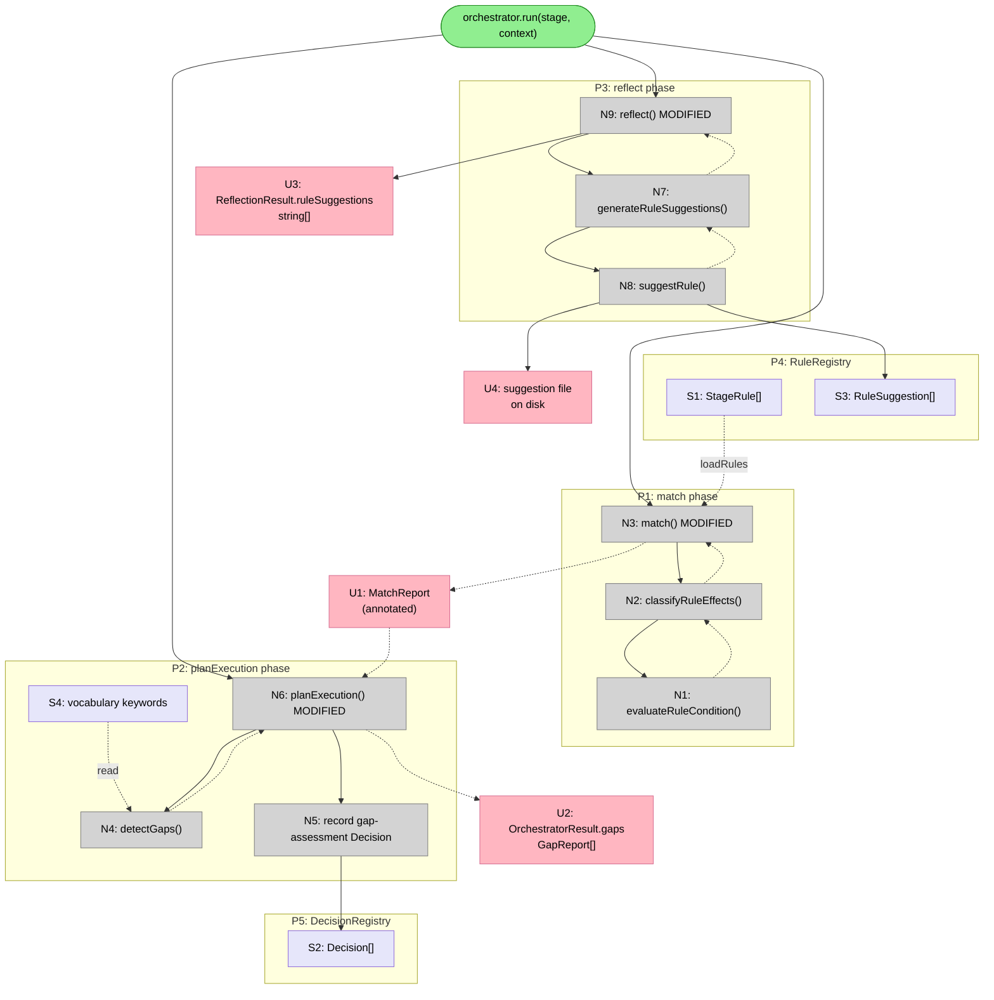

# Wave C Session 1 — Breadboard

> **Code-only system.** No UI screens. "Places" are the orchestration phases in
> `BaseStageOrchestrator`. The "UI Affordances" table captures observable contracts
> (return types, persisted state) that callers and tests depend on. Code affordances
> are method-level mechanisms.

---

## Places

| #  | Place                    | Description                                                              |
| -- | ------------------------ | ------------------------------------------------------------------------ |
| P0 | `orchestrator.run()`     | Entry coordinator — sequences all 6 phases (unchanged except gap wiring) |
| P1 | match phase              | `match(stage, context)` — now rule-augmented; evaluates conditions, applies effects |
| P2 | planExecution phase      | `planExecution(matchResult, context)` — now gap-augmented; detects coverage gaps |
| P3 | reflect phase            | `reflect(decisions, flavorResults)` — now suggestion-generating; wires outcomes to rule registry |
| P4 | RuleRegistry             | Persistent store: active `StageRule[]` and pending `RuleSuggestion[]` |
| P5 | DecisionRegistry         | In-memory + disk store: all `Decision[]` recorded this run |

---

## Public Contracts (Observable Outputs)

What changes from outside the orchestrator. These drive the acceptance criteria and tests.

| #  | Place | Component                   | Affordance                                                        | Control | Wires Out | Returns To  |
| -- | ----- | --------------------------- | ----------------------------------------------------------------- | ------- | --------- | ----------- |
| U1 | P1    | `MatchReport`               | `ruleAdjustments` field is non-zero when rules fire; `reasoning` annotated with rule info | return | — | → P2 (planExecution receives matchReports) |
| U2 | P2    | `OrchestratorResult.gaps`   | `gaps?: GapReport[]` — NEW field on the result (schema change)    | return  | — | → test assertions, kata status display |
| U3 | P3    | `ReflectionResult.ruleSuggestions` | `ruleSuggestions` now populated with suggestion IDs (was empty array) | return | → P4 | → test assertions |
| U4 | P4    | `RuleSuggestion` on disk    | Suggestion persisted to `.kata/rules/suggestions/<id>.json`       | write   | — | → (future `kata knowledge rules --pending`) |

---

## Code Affordances

### P1 — match phase (rule wiring, #103)

New private methods added to `BaseStageOrchestrator`:

| #  | Place | Component                  | Affordance                                              | Control | Wires Out | Returns To     |
| -- | ----- | -------------------------- | ------------------------------------------------------- | ------- | --------- | -------------- |
| N1 | P1    | BaseStageOrchestrator      | `evaluateRuleCondition(rule, betText, artifacts, category): boolean` — strips stop words from `rule.condition`; returns true if any word appears in betText \| stageCategory \| artifact names | call | — | → N2 |
| N2 | P1    | BaseStageOrchestrator      | `classifyRuleEffects(rules, capProfile): ClassifiedRules` — iterates rules, calls N1 for each; builds `{excluded: Set<string>, required: Set<string>, adjustments: Map<flavorName, number>}` where adjustments = `±magnitude * confidence` per boost/penalize rule | call | → N1 | → N3 |
| N3 | P1    | BaseStageOrchestrator      | `match(stage, context)` [**MODIFIED**] — after building excluded/pinned from stage config: calls N2, merges `excluded` into excluded Set (rule excludes win), merges `required` into pinned Set (only if not in excluded); applies `adjustments` to candidate scores; annotates MatchReport.reasoning | call | → S1 (reads rules), → N2 | → U1, → N6 |

**Rule precedence in N3:**
1. Load `excluded` from `stage.excludedFlavors` + rule-based excludes from N2
2. Load `pinned` from `stage.pinnedFlavors` + rule-based requires from N2 (exclude wins over require)
3. For candidates: `score = clamp(base + N2.adjustments.get(flavor.name) ?? 0, 0, 1)`

**Convention documented (not a schema change):** `StageRule.name` = flavor name being targeted; `StageRule.condition` = context description for matching.

---

### P2 — planExecution phase (gap analysis, #104)

New private method + type extension:

| #  | Place | Component                  | Affordance                                              | Control | Wires Out | Returns To      |
| -- | ----- | -------------------------- | ------------------------------------------------------- | ------- | --------- | --------------- |
| N4 | P2    | BaseStageOrchestrator      | `detectGaps(selectedFlavors, context): GapReport[]` — for each vocabulary keyword (`this.vocabulary?.keywords`): if it appears in `betText(context)` AND no selected flavor's name/description contains it → gap. Finds `suggestedFlavors` from available unselected flavors that mention the keyword. Severity: high for first-third of keywords, medium for second-third, low for rest | call | — | → N5 |
| N5 | P2    | DecisionRegistry           | `decisionRegistry.record(gap-assessment decision)` — records decision with type `'gap-assessment'`, context `{gapCount, gaps, selectedFlavors}`, options `['gaps-found','no-gaps']`, selection based on count | call | → S2 | → N6 |
| N6 | P2    | BaseStageOrchestrator      | `planExecution(matchResult, context)` [**MODIFIED**] — after flavor selection calls N4, then N5; adds `gaps: GapReport[]` to return | call | → N4, → N5 | → U2, → P0 |

**Schema change:** Add `gaps?: GapReport[]` to `OrchestratorResult` interface in `src/domain/ports/stage-orchestrator.ts`. Also add `gaps` to the destructured return in `run()` and include in result.

---

### P3 — reflect phase (rule suggestions, #49 MVP)

New private method:

| #  | Place | Component                  | Affordance                                              | Control | Wires Out  | Returns To     |
| -- | ----- | -------------------------- | ------------------------------------------------------- | ------- | ---------- | -------------- |
| N7 | P3    | BaseStageOrchestrator      | `generateRuleSuggestions(decisions, decisionOutcomes): string[]` — filters decisions for `decisionType === 'flavor-selection'`; for each, finds outcome quality from decisionOutcomes; `'good'` → boost suggestion (name=flavor, condition=bet keywords from decision.context, magnitude=0.3, confidence=0.6); `'poor'` → penalize; calls N8 per suggestion; returns suggestion IDs | call | → N8 | → N9 |
| N8 | P4    | RuleRegistry               | `ruleRegistry.suggestRule(suggestion)` — non-fatal: wrapped in try/catch, logs warn on failure | call | → U4, → S3 | → N7 |
| N9 | P3    | BaseStageOrchestrator      | `reflect(decisions, flavorResults)` [**MODIFIED**] — after existing outcome recording, calls N7 with `decisions` and the `decisionOutcomes` already built; populates `ReflectionResult.ruleSuggestions` | call | → N7 | → U3, → P0 |

**Outcome source:** `decisionOutcomes` is already built by `reflect()` before N7 is called — it pairs each decision ID with its outcome. `Decision.selection` gives the selected flavor name.

**Bet keyword extraction for condition:** From `decision.context.bet` (typed as `Record<string, unknown>`), extract title/description as a short string (max 50 chars) for the suggestion condition.

---

## Data Stores

| #  | Place | Store                                              | Description                                           |
| -- | ----- | -------------------------------------------------- | ----------------------------------------------------- |
| S1 | P4    | `StageRule[]` (loaded per category)                | Active rules — read by N2 via `ruleRegistry.loadRules()` |
| S2 | P5    | `Decision[]` (in-memory + decisions.jsonl)         | All decisions for this run — written by N5, read by N9 |
| S3 | P4    | `RuleSuggestion[]` (pending, on disk)              | Suggestions awaiting review — written by N8 |
| S4 | P2    | `this.vocabulary?.keywords: string[]`              | Stage vocabulary keywords — read by N4 for gap analysis (in-memory, loaded at construction) |

---

## Mermaid Diagram

---

## Vertical Slices

### Slice Summary

| #  | Slice                    | Shape parts | Closes | Demo                                                                                     |
| -- | ------------------------ | ----------- | ------ | ---------------------------------------------------------------------------------------- |
| V1 | Rule effects on scoring  | A1          | #103   | Rules with boost/penalize change MatchReport.score; require adds to pinned; exclude adds to excluded |
| V2 | Gap analysis in plan     | A2          | #104   | Bet mentioning vocabulary keywords not covered by selected flavor → non-empty GapReport[] in result |
| V3 | Reflect suggestions (MVP)| A3          | #49 partial | After stage with flavor-selection decisions, RuleRegistry has pending suggestions with correct effect |

---

### V1: Rule Effects on Scoring

**Demo:** A stage run where active rules include a boost for `"codebase-analysis"` with condition `"auth"` and the bet contains "authentication" → `MatchReport.score` for that flavor is higher than base; `ruleAdjustments` field is non-zero; reasoning mentions the rule.

**Affordances added:**

| #  | Component             | Affordance                          | Control | Wires Out | Returns To |
| -- | --------------------- | ----------------------------------- | ------- | --------- | ---------- |
| N1 | BaseStageOrchestrator | `evaluateRuleCondition()`           | call    | —         | → N2       |
| N2 | BaseStageOrchestrator | `classifyRuleEffects()`             | call    | → N1      | → N3       |
| N3 | BaseStageOrchestrator | `match()` [MODIFIED]                | call    | → N2      | → U1       |
| U1 | MatchReport           | annotated `ruleAdjustments+reasoning` | return | —         | —          |

**Files changed:**
- `src/domain/services/stage-orchestrator.ts` — add N1, N2; modify N3/match(), replace `computeRuleAdjustments()` stub

**Tests:** `stage-orchestrator.test.ts` — boost rule increases score, penalize decreases, require adds to pinned, exclude adds to excluded, precedence: exclude wins over require.

---

### V2: Gap Analysis in Plan Phase

**Demo:** Run with vocabulary containing keyword "typescript" and bet title "Add TypeScript module" but selected flavor is "api-design" (no "typescript" in name/description) → `result.gaps` contains one `GapReport` with description mentioning "typescript" and suggestedFlavors pointing to any available flavor that covers it.

**Affordances added:**

| #  | Component             | Affordance                          | Control | Wires Out | Returns To |
| -- | --------------------- | ----------------------------------- | ------- | --------- | ---------- |
| N4 | BaseStageOrchestrator | `detectGaps()`                      | call    | —         | → N6       |
| N5 | DecisionRegistry      | `record(gap-assessment)`            | call    | → S2      | —          |
| N6 | BaseStageOrchestrator | `planExecution()` [MODIFIED]        | call    | → N4, → N5 | → U2      |
| U2 | OrchestratorResult    | `gaps?: GapReport[]` NEW field      | return  | —         | —          |

**Files changed:**
- `src/domain/services/stage-orchestrator.ts` — add N4; modify N6/planExecution()
- `src/domain/ports/stage-orchestrator.ts` — add `gaps?: GapReport[]` to `OrchestratorResult`

**Tests:** `stage-orchestrator.test.ts` — no vocabulary → empty gaps; bet keyword in vocab AND covered by flavor → empty; bet keyword in vocab AND not covered → gap with correct severity and suggestedFlavors.

---

### V3: Reflect Suggestions (MVP)

**Demo:** Stage run where executor returns a synthesis artifact (good outcome). `reflect()` records outcomes for decisions. A flavor-selection decision with `artifactQuality: 'good'` → `RuleRegistry.getPendingSuggestions()` returns one boost suggestion for the selected flavor.

**Affordances added:**

| #  | Component             | Affordance                          | Control | Wires Out | Returns To |
| -- | --------------------- | ----------------------------------- | ------- | --------- | ---------- |
| N7 | BaseStageOrchestrator | `generateRuleSuggestions()`         | call    | → N8      | → N9       |
| N8 | RuleRegistry          | `suggestRule()` (non-fatal)         | call    | → S3      | → N7       |
| N9 | BaseStageOrchestrator | `reflect()` [MODIFIED]              | call    | → N7      | → U3       |
| U3 | ReflectionResult      | `ruleSuggestions` populated         | return  | —         | —          |

**Files changed:**
- `src/domain/services/stage-orchestrator.ts` — add N7; modify N9/reflect()

**Tests:** `stage-orchestrator.test.ts` — good outcome flavor-selection decision → boost suggestion in registry; poor outcome → penalize suggestion; no rule registry → no crash; partial outcome → no suggestion generated (only good/poor trigger suggestions).

---

## Scope Coverage Verification

| Req | Requirement                                           | Affordances | Covered? |
| --- | ----------------------------------------------------- | ----------- | -------- |
| R0  | Wire orchestration intelligence loop                  | V1+V2+V3    | Yes      |
| R1  | Rule effects change flavor scores                     | N1, N2, N3  | Yes      |
| R2  | Rule precedence: exclude > require > boost/penalize   | N2, N3      | Yes      |
| R3  | Rule condition matching against capability profile    | N1          | Yes      |
| R4  | Rule applications logged in MatchReport reasoning     | N3 (annotation) | Yes  |
| R5  | Gap analysis produces GapReport[] after flavor select | N4, N6, U2  | Yes      |
| R6  | Gap analysis records gap-assessment Decision          | N5          | Yes      |
| R7  | Reflect generates suggestions via suggestRule()       | N7, N8, U3  | Yes      |
| R8  | MVP reflect — current stage only, no history          | N7 (local only) | Yes  |
| R9  | Session fit: ≥2 closed issues                         | V1(#103) + V2(#104) | Yes |
| R10 | No cooldown (#45)                                     | Not in scope | Yes (out) |
| R11 | No #49 stretch goals                                  | Not in scope | Yes (out) |
| R12 | No #105 flavor/manifest layer                         | Not in scope | Yes (out) |

---

## Decision Points Log

| # | Decision                                      | Options                          | Selected               | Reason |
| - | --------------------------------------------- | -------------------------------- | ---------------------- | ------ |
| 1 | Gap severity heuristic                        | Vocabulary index-based, keyword weight, flat medium | Index-based (first-third=high, second-third=medium, rest=low) | Simple, deterministic, no config needed |
| 2 | `OrchestratorResult.gaps` field               | Add to port interface, add to internal result only | Add to port interface | Needed for tests and future kata status display |
| 3 | Suggest only for good/poor (not partial)      | All outcomes, only extremes | good/poor only | Partial outcomes are ambiguous — don't generate low-confidence suggestions |
| 4 | Rule.name = flavor name convention            | Schema change (add flavorTarget field), use name, use condition | Use `name` = flavor name | No schema change; convention documented in breadboard and code comments |
| 5 | planExecution return type                     | Keep internal return, expose via OrchestratorResult | Expose via OrchestratorResult only | Tests can assert on final result; internal return stays narrow |
