# Wave C S3+S4 — Cooldown Feedback Loop: Breadboard

## Places

| #  | Place                  | Description                                                                          |
| -- | ---------------------- | ------------------------------------------------------------------------------------ |
| P1 | KiaiRunner             | Orchestration execution context — reflect phase creates rule suggestions             |
| P2 | kata cooldown CLI      | Interactive command handler — bet outcomes, rule review, formatted/JSON output       |
| P3 | CooldownSession        | Domain service — aggregates run data, rule suggestions, proposals                    |
| P4 | ProposalGenerator      | Domain service — generates next-cycle proposals from all sources                     |
| P5 | CrossRunAnalyzer       | Pure functions module — cross-run pattern detection (S4)                             |
| P6 | RuleRegistry           | Infrastructure service — reads/writes rule + suggestion files                        |
| P7 | kata rule CLI commands | Standalone `kata rule accept/reject` commands for programmatic/LLM-driven rule review without running full cooldown |

---

## UI Affordances (CLI inputs and outputs)

| #   | Place | Component             | Affordance                                                                              | Control | Wires Out     | Returns To |
| --- | ----- | --------------------- | --------------------------------------------------------------------------------------- | ------- | ------------- | ---------- |
| U1  | P2    | cooldown cmd          | `--skip-prompts` flag                                                                   | flag    | → N9 (skip)   | —          |
| U2  | P2    | cooldown cmd          | suggestion display: `[effect] flavor "name" — condition (N observations)`               | render  | —             | —          |
| U3  | P2    | cooldown cmd          | accept/reject/defer select prompt (one per suggestion)                                  | select  | → N10         | —          |
| U4  | P2    | cooldown cmd          | rejection reason input prompt                                                           | input   | → N11         | —          |
| U5  | P2    | cycle-formatter       | `--- Rule Suggestions ---` section (accepted N, rejected N, deferred N + rule names)   | render  | —             | —          |
| U6  | P2    | cooldown cmd          | `--json` output fields `ruleSuggestions` and `suggestionReview`                         | render  | —             | —          |
| U7  | P2    | cycle-formatter       | `yoloDecisionCount` inline in Run Summaries line (S4)                                  | render  | —             | —          |
| U8  | P2    | cycle-formatter       | `cross-gap` and `unused-flavor` proposals in `=== Next-Cycle Proposals ===` (S4)        | render  | —             | —          |
| U9  | P2    | cooldown cmd          | `--auto-accept-suggestions` flag — accepts all pending suggestions non-interactively **← B10 R11** | flag | → N30 | —          |
| U10 | P7    | rules cmd             | acceptance confirmation: `Accepted rule: [effect] [flavor] [condition]`                 | render  | —             | —          |
| U11 | P7    | rules cmd             | rejection confirmation: `Rejected suggestion <id>`                                      | render  | —             | —          |

---

## Code Affordances

### P1: KiaiRunner — Orchestration execution

| #   | Place | Component                 | Affordance                                          | Control | Wires Out              | Returns To |
| --- | ----- | ------------------------- | --------------------------------------------------- | ------- | ---------------------- | ---------- |
| N1  | P1    | kiai-runner.ts            | `KiaiRunner.runStage(category, options)`            | call    | → N2                   | —          |
| N2  | P1    | kiai-runner.ts            | `createStageOrchestrator(category, deps, config)` **← B1: add `ruleRegistry` to deps** | call | → N3 | — |
| N3  | P1    | stage-orchestrator.ts     | `BaseStageOrchestrator.reflect()`                   | call    | → N4                   | —          |
| N4  | P1    | stage-orchestrator.ts     | `ruleRegistry.suggestRule(suggestion)`              | call    | → S1                   | —          |

### P2: kata cooldown CLI — Interactive handler

| #   | Place | Component                 | Affordance                                                                 | Control | Wires Out              | Returns To   |
| --- | ----- | ------------------------- | -------------------------------------------------------------------------- | ------- | ---------------------- | ------------ |
| N5  | P2    | cycle.ts                  | `withCommandContext(async (ctx, cycleId) => {...})` handler                | invoke  | → N6, → N7             | —            |
| N6  | P2    | cycle.ts                  | `new RuleRegistry(kataDirPath(ctx.kataDir, 'rules'))` **← B5 new**        | call    | → N7                   | —            |
| N7  | P2    | cycle.ts                  | `new CooldownSession({..., ruleRegistry})` **← B2/B5 new dep**            | call    | → N8                   | —            |
| N8  | P2    | cycle.ts                  | `session.run(cycleId, betOutcomes)`                                        | call    | —                      | → N9         |
| N9  | P2    | cycle.ts                  | suggestion review loop (iterates `result.ruleSuggestions`) **← B3**       | loop    | → N30 (if flag), → U2, → U3, → N10, → N11 | —  |
| N10 | P2    | cycle.ts                  | `ruleRegistry.acceptSuggestion(suggestion.id)` **← B4**                   | call    | → P6 (N17)             | —            |
| N11 | P2    | cycle.ts                  | `ruleRegistry.rejectSuggestion(suggestion.id, reason)` **← B4**           | call    | → P6 (N18)             | —            |
| N12 | P2    | cycle-formatter.ts        | `formatCooldownSessionResult(result)` **← B5 updated**                    | call    | → U5                   | —            |
| N30 | P2    | cycle.ts                  | auto-accept all suggestions (skips prompts, calls N10 for each) — active when `--auto-accept-suggestions` set **← B10 R11** | cond | → N10 (each) | —  |

### P3: CooldownSession — Domain service

| #   | Place | Component                 | Affordance                                                                       | Control | Wires Out    | Returns To |
| --- | ----- | ------------------------- | -------------------------------------------------------------------------------- | ------- | ------------ | ---------- |
| N13 | P3    | cooldown-session.ts       | `CooldownSession.run(cycleId, betOutcomes)` — existing entry point               | call    | → N14, → N15 | → N8       |
| N14 | P3    | cooldown-session.ts       | `ruleRegistry.getPendingSuggestions()` **← B2 new**                              | call    | —            | → N16      |
| N15 | P3    | cooldown-session.ts       | `proposalGenerator.generate(cycleId, runSummaries)` — existing                  | call    | —            | → N13      |
| N16 | P3    | cooldown-session.ts       | return `CooldownSessionResult { ...existing, ruleSuggestions? }` **← B2 new field** | return | —         | → N8       |
| N17 | P3    | cooldown-session.ts       | `loadRunSummaries(cycle)` **← B6 extended: adds stageDetails + yoloDecisionCount** | call  | → N18, → N19 | → N15      |
| N18 | P3    | cooldown-session.ts       | reads `StageState.selectedFlavors` per stage **← B6**                           | read    | —            | → N17      |
| N19 | P3    | cooldown-session.ts       | counts `DecisionEntry.lowConfidence === true` per run **← B6**                  | read    | —            | → N17      |

### P4: ProposalGenerator — Domain service

| #   | Place | Component                 | Affordance                                                                           | Control | Wires Out         | Returns To |
| --- | ----- | ------------------------- | ------------------------------------------------------------------------------------ | ------- | ----------------- | ---------- |
| N20 | P4    | proposal-generator.ts     | `generate(cycleId, runSummaries?)` — existing entry point                            | call    | → N21, → N22      | → N15      |
| N21 | P4    | proposal-generator.ts     | `analyzeRunData(summaries)` — existing; emits `'run-gap'` + `'low-confidence'` + yolo proposal **← B9 extend** | call | — | → N20 |
| N22 | P4    | proposal-generator.ts     | `analyzeCrossRunPatterns(summaries)` **← B8 new**                                    | call    | → N23, → N24      | → N20      |

### P5: CrossRunAnalyzer — Pure functions (S4)

| #   | Place | Component                 | Affordance                                                                          | Control | Wires Out | Returns To |
| --- | ----- | ------------------------- | ----------------------------------------------------------------------------------- | ------- | --------- | ---------- |
| N23 | P5    | cross-run-analyzer.ts     | `analyzeFlavorFrequency(summaries: RunSummary[]): Map<string, number>` **← B7**     | call    | —         | → N22      |
| N24 | P5    | cross-run-analyzer.ts     | `analyzeRecurringGaps(summaries): Array<{description, severity, betCount}>` **← B7** | call  | —         | → N22      |

### P6: RuleRegistry — Infrastructure

| #   | Place | Component                 | Affordance                                                         | Control | Wires Out | Returns To |
| --- | ----- | ------------------------- | ------------------------------------------------------------------ | ------- | --------- | ---------- |
| N25 | P6    | rule-registry.ts          | `getPendingSuggestions(category?)` → scans S1                      | call    | —         | → N14      |
| N26 | P6    | rule-registry.ts          | `acceptSuggestion(id, editDelta?)` → writes to S2, marks S1 entry | call    | → S2      | —          |
| N27 | P6    | rule-registry.ts          | `rejectSuggestion(id, reason)` → updates S1 entry status          | call    | → S1      | —          |

### P7: kata rule CLI — Programmatic commands (R10)

| #   | Place | Component                 | Affordance                                                           | Control | Wires Out       | Returns To |
| --- | ----- | ------------------------- | -------------------------------------------------------------------- | ------- | --------------- | ---------- |
| N28 | P7    | rules.ts                  | `kata rule accept <id>` handler **← B10**                            | invoke  | → N26, → U10    | —          |
| N29 | P7    | rules.ts                  | `kata rule reject <id> --reason` handler **← B10**                   | invoke  | → N27, → U11    | —          |

---

## Data Stores

| #  | Place | Store                              | Description                                                    |
| -- | ----- | ---------------------------------- | -------------------------------------------------------------- |
| S1 | P6    | `.kata/rules/suggestions/*.json`   | Pending/accepted/rejected `RuleSuggestion` files (one per id) |
| S2 | P6    | `.kata/rules/{category}/*.json`    | Active `StageRule` files (one per id, nested by category)      |

---

## New Types

```typescript
// src/features/cycle-management/types.ts additions

/** S3: Review record for a single rule suggestion during cooldown */
export interface SuggestionReviewRecord {
  id: string;
  decision: 'accepted' | 'rejected' | 'deferred';
  rejectionReason?: string;
}

/** S4: Per-stage detail added to RunSummary for cross-run analysis */
export interface StageDetail {
  category: StageCategory;
  selectedFlavors: string[];
  gaps: Array<{ description: string; severity: 'low' | 'medium' | 'high' }>;
}

// RunSummary gains (S4):
//   stageDetails: StageDetail[]
//   yoloDecisionCount: number

// CooldownSessionResult gains (S3):
//   ruleSuggestions?: RuleSuggestion[]
//   suggestionReview?: { accepted: number; rejected: number; deferred: number }
```

```typescript
// src/features/cycle-management/proposal-generator.ts additions (S4)
// New sources added to CycleProposal.source union:
source: '...' | 'cross-gap' | 'unused-flavor';

// sourceOrder additions:
'cross-gap': 1.5,      // between dependency(1) and run-gap(2)
'unused-flavor': 3.5,  // between unblocked(3) and learning(4)
```

---

## Mermaid Diagram

```mermaid
flowchart TB
  subgraph P1["P1: KiaiRunner (kata execute)"]
    N1["N1: runStage()"]
    N2["N2: createStageOrchestrator()\n← B1: add ruleRegistry"]
    N3["N3: reflect()"]
    N4["N4: ruleRegistry.suggestRule()"]
  end

  subgraph P6["P6: RuleRegistry"]
    N25["N25: getPendingSuggestions()"]
    N26["N26: acceptSuggestion()"]
    N27["N27: rejectSuggestion()"]
    S1[("S1: .kata/rules/suggestions/")]
    S2[("S2: .kata/rules/{category}/")]
  end

  subgraph P3["P3: CooldownSession"]
    N13["N13: run()"]
    N14["N14: getPendingSuggestions()\n← B2 new"]
    N15["N15: generate(cycleId, summaries)"]
    N16["N16: return result\n+ ruleSuggestions ← B2"]
    N17["N17: loadRunSummaries()\n← B6 extended"]
    N18["N18: read selectedFlavors"]
    N19["N19: count lowConfidence"]
  end

  subgraph P4["P4: ProposalGenerator"]
    N20["N20: generate()"]
    N21["N21: analyzeRunData()\n← B9 extend yolo"]
    N22["N22: analyzeCrossRunPatterns()\n← B8 new"]
  end

  subgraph P5["P5: CrossRunAnalyzer (S4)"]
    N23["N23: analyzeFlavorFrequency()"]
    N24["N24: analyzeRecurringGaps()"]
  end

  subgraph P2["P2: kata cooldown CLI"]
    N5["N5: handler"]
    N6["N6: new RuleRegistry()\n← B5"]
    N7["N7: new CooldownSession({ruleRegistry})\n← B5"]
    N8["N8: session.run()"]
    N9["N9: suggestion review loop\n← B3"]
    N10["N10: acceptSuggestion()\n← B4"]
    N11["N11: rejectSuggestion()\n← B4"]
    N12["N12: formatCooldownSessionResult()\n← B5 updated"]
    N30["N30: auto-accept all\n← B10 R11"]

    U2["U2: suggestion display"]
    U3["U3: accept/reject/defer prompt"]
    U4["U4: rejection reason input"]
    U5["U5: Rule Suggestions section"]
    U6["U6: --json output"]
    U7["U7: yolo count in Run Summaries"]
    U8["U8: cross-gap/unused-flavor proposals"]
    U9["U9: --auto-accept-suggestions flag"]
  end

  subgraph P7["P7: kata rule CLI (R10)"]
    N28["N28: kata rule accept handler\n← B10"]
    N29["N29: kata rule reject handler\n← B10"]
    U10["U10: acceptance confirmation"]
    U11["U11: rejection confirmation"]
  end

  %% P1 orchestration flow
  N1 --> N2
  N2 --> N3
  N3 --> N4
  N4 --> S1

  %% CLI handler wires
  N5 --> N6
  N6 --> N7
  N7 --> N8
  N8 -.-> N9

  %% Suggestion review loop
  U9 -->|flag set| N30
  N30 -->|each suggestion| N10
  N9 -->|interactive| U2
  N9 -->|interactive| U3
  U3 -->|accept| N10
  U3 -->|reject| U4
  U4 --> N11

  N10 --> N26
  N11 --> N27
  N26 --> S2
  N26 --> S1
  N27 --> S1

  %% Programmatic kata rule commands
  N28 --> N26
  N28 --> U10
  N29 --> N27
  N29 --> U11

  %% CooldownSession flow
  N8 --> N13
  N13 --> N14
  N14 --> N25
  N25 -.-> S1
  N25 -.-> N14
  N13 --> N15
  N13 --> N17
  N17 --> N18
  N17 --> N19
  N16 -.-> N8

  %% ProposalGenerator flow
  N15 --> N20
  N20 --> N21
  N20 --> N22
  N22 --> N23
  N22 --> N24
  N23 -.-> N22
  N24 -.-> N22

  %% Formatter output
  N8 -.-> N12
  N12 --> U5
  N8 -.-> U6
  N21 -.-> U7
  N22 -.-> U8

  classDef ui fill:#ffb6c1,stroke:#d87093,color:#000
  classDef nonui fill:#d3d3d3,stroke:#808080,color:#000
  classDef store fill:#e6e6fa,stroke:#9370db,color:#000
  classDef new fill:#90EE90,stroke:#228B22,color:#000

  class U2,U3,U4,U5,U6,U7,U8,U9,U10,U11 ui
  class N1,N2,N3,N4,N5,N6,N7,N8,N9,N10,N11,N12,N13,N14,N15,N16,N17,N18,N19,N20,N21,N22,N23,N24,N25,N26,N27,N28,N29,N30 nonui
  class S1,S2 store
  class N2,N4,N6,N7,N9,N10,N11,N14,N16,N17,N18,N19,N22,N23,N24,N28,N29,N30,U2,U3,U4,U5,U6,U7,U8,U9,U10,U11 new
```



---

## Vertical Slices

### Slice Summary

| #  | Slice                                        | Parts        | Demo                                                                                         |
| -- | -------------------------------------------- | ------------ | -------------------------------------------------------------------------------------------- |
| V1 | KiaiRunner wiring + suggestion aggregation   | B1, B2       | `kata execute && kata cooldown --json` → `ruleSuggestions` array populated in result         |
| V2 | Interactive review + auto-accept flag        | B3, B10 (R11) | `kata cooldown` prompts for each suggestion; `--auto-accept-suggestions` accepts all non-interactively |
| V3 | Apply accepted/rejected rules                | B4           | Accept → `ls .kata/rules/build/` shows new rule file; reject → suggestion marked 'rejected'  |
| V4 | Formatter + --json updates                   | B5           | Formatted output shows `--- Rule Suggestions ---` with counts; `--json` includes `suggestionReview` |
| V5 | Extended RunSummary + CrossRunAnalyzer       | B6, B7       | `--json` shows `stageDetails` with `selectedFlavors` per stage; flavor frequency computed    |
| V6 | Cross-run proposals in ProposalGenerator     | B8           | `kata cooldown --json` shows `cross-gap` and `unused-flavor` proposals when patterns detected |
| V7 | Yolo surfacing in proposals + formatter      | B9           | `kata cooldown` Run Summaries shows `yoloDecisionCount`; `analyzeRunData` emits yolo proposal |
| V8 | `kata rule accept/reject` programmatic cmds  | B10 (R10)    | `kata rule accept <uuid>` → rule file at `.kata/rules/build/<uuid>.json`; `--json` machine-readable |

### V1: KiaiRunner wiring + suggestion aggregation

| #   | Component             | Affordance                                    | Control | Wires Out    | Returns To |
| --- | --------------------- | --------------------------------------------- | ------- | ------------ | ---------- |
| N2  | kiai-runner.ts        | `createStageOrchestrator(...deps + ruleRegistry)` | call | → N3        | —          |
| N4  | stage-orchestrator.ts | `ruleRegistry.suggestRule(suggestion)`        | call    | → S1         | —          |
| N13 | cooldown-session.ts   | `CooldownSession.run()`                       | call    | → N14        | → N8       |
| N14 | cooldown-session.ts   | `ruleRegistry.getPendingSuggestions()`        | call    | —            | → N16      |
| N16 | cooldown-session.ts   | return `CooldownSessionResult` + `ruleSuggestions?` | return | —       | → N8       |
| N25 | rule-registry.ts      | `getPendingSuggestions()`                     | call    | —            | → N14      |
| S1  | —                     | `.kata/rules/suggestions/*.json`              | read    | —            | → N25      |

**Demo:** After `kata execute` (with a real run), `kata cooldown --json` shows `"ruleSuggestions": [...]` with pending suggestions populated. With no prior runs, shows `"ruleSuggestions": []`.

### V2: Interactive review + auto-accept flag

| #   | Component      | Affordance                                           | Control | Wires Out                     | Returns To |
| --- | -------------- | ---------------------------------------------------- | ------- | ----------------------------- | ---------- |
| N9  | cycle.ts       | suggestion review loop                               | loop    | → N30 (if flag), → U2, → U3  | —          |
| U9  | cycle.ts       | `--auto-accept-suggestions` flag                     | flag    | → N30                         | —          |
| N30 | cycle.ts       | auto-accept all (skips prompts, calls N10 each)      | cond    | → N10 (each)                  | —          |
| U2  | cycle.ts       | suggestion display line                              | render  | —                             | —          |
| U3  | cycle.ts       | accept/reject/defer select prompt                    | select  | → N10 or → U4                 | —          |
| U4  | cycle.ts       | rejection reason input                               | input   | → N11                         | —          |

**Demo (interactive):** `kata cooldown <id>` shows each pending suggestion with its effect, flavor name, and condition, then prompts to accept, reject, or defer.

**Demo (headless):** `kata cooldown <id> --auto-accept-suggestions` accepts all suggestions without prompts — usable in fully automated pipelines.

### V3: Apply accepted/rejected rules

| #   | Component        | Affordance                              | Control | Wires Out  | Returns To |
| --- | ---------------- | --------------------------------------- | ------- | ---------- | ---------- |
| N10 | cycle.ts         | `ruleRegistry.acceptSuggestion(id)`     | call    | → N26      | —          |
| N11 | cycle.ts         | `ruleRegistry.rejectSuggestion(id, r)`  | call    | → N27      | —          |
| N26 | rule-registry.ts | `acceptSuggestion()` → writes rule      | call    | → S2, → S1 | —          |
| N27 | rule-registry.ts | `rejectSuggestion()` → marks rejected   | call    | → S1       | —          |
| S2  | —                | `.kata/rules/{category}/*.json`         | write   | —          | —          |

**Demo:** Accept a suggestion → `cat .kata/rules/build/<uuid>.json` shows the new `StageRule`. Reject → suggestion file shows `"status": "rejected"`. Deferred → still `"status": "pending"`.

### V4: Formatter + --json updates

| #   | Component         | Affordance                                            | Control | Wires Out | Returns To |
| --- | ----------------- | ----------------------------------------------------- | ------- | --------- | ---------- |
| N6  | cycle.ts          | `new RuleRegistry(kataDirPath(kataDir, 'rules'))`     | call    | → N7      | —          |
| N7  | cycle.ts          | `new CooldownSession({..., ruleRegistry})`            | call    | → N8      | —          |
| N12 | cycle-formatter.ts | `formatCooldownSessionResult()` updated               | call    | → U5      | —          |
| U5  | cycle-formatter.ts | `--- Rule Suggestions ---` section                   | render  | —         | —          |
| U6  | cycle.ts          | `--json` includes `suggestionReview`                  | render  | —         | —          |

**Demo:** Formatted output after cooldown shows `--- Rule Suggestions --- / Accepted: 1, Rejected: 0, Deferred: 2`. `--json` includes `"suggestionReview": {"accepted":1,"rejected":0,"deferred":2}`.

### V5: Extended RunSummary + CrossRunAnalyzer

| #   | Component               | Affordance                                                    | Control | Wires Out     | Returns To |
| --- | ----------------------- | ------------------------------------------------------------- | ------- | ------------- | ---------- |
| N17 | cooldown-session.ts     | `loadRunSummaries()` extended                                 | call    | → N18, → N19  | → N15      |
| N18 | cooldown-session.ts     | read `StageState.selectedFlavors` per stage                   | read    | —             | → N17      |
| N19 | cooldown-session.ts     | count `DecisionEntry.lowConfidence === true`                  | read    | —             | → N17      |
| N23 | cross-run-analyzer.ts   | `analyzeFlavorFrequency(summaries)`                           | call    | —             | → N22      |
| N24 | cross-run-analyzer.ts   | `analyzeRecurringGaps(summaries)`                             | call    | —             | → N22      |

**Demo:** `kata cooldown --json` shows `runSummaries[0].stageDetails` with `selectedFlavors: ["architecture", "shaping"]` per stage. `analyzeFlavorFrequency` unit tests pass with expected counts.

### V6: Cross-run proposals

| #   | Component             | Affordance                                         | Control | Wires Out     | Returns To |
| --- | --------------------- | -------------------------------------------------- | ------- | ------------- | ---------- |
| N22 | proposal-generator.ts | `analyzeCrossRunPatterns(summaries)`               | call    | → N23, → N24  | → N20      |
| N20 | proposal-generator.ts | `generate()` calls analyzeCrossRunPatterns         | call    | → N22         | → N15      |
| U8  | cycle-formatter.ts    | cross-gap and unused-flavor proposals rendered     | render  | —             | —          |

**Demo:** With 3 bets all having the same gap description, `kata cooldown --json` shows `proposals` including a `"source": "cross-gap"` entry with `"priority": "high"` and `"relatedBetIds": [b1, b2, b3]`.

### V7: Yolo surfacing

| #   | Component             | Affordance                                                           | Control | Wires Out | Returns To |
| --- | --------------------- | -------------------------------------------------------------------- | ------- | --------- | ---------- |
| N21 | proposal-generator.ts | `analyzeRunData()` extended: sum yoloDecisionCount → low-confidence proposal if > 0 | call | — | → N20 |
| U7  | cycle-formatter.ts    | `yoloDecisionCount` in Run Summaries line                            | render  | —         | —          |

**Demo:** Run with `--yolo` flag used → `kata cooldown` Run Summaries line shows `2 --yolo decision(s) bypassed confidence gate`. Proposals include `"source": "low-confidence"` entry noting total --yolo count.

### V8: `kata rule accept/reject` programmatic commands

| #   | Component    | Affordance                                                | Control | Wires Out     | Returns To |
| --- | ------------ | --------------------------------------------------------- | ------- | ------------- | ---------- |
| N28 | rules.ts     | `kata rule accept <id>` handler                           | invoke  | → N26, → U10  | —          |
| N29 | rules.ts     | `kata rule reject <id> --reason` handler                  | invoke  | → N27, → U11  | —          |
| U10 | rules.ts     | acceptance confirmation output                            | render  | —             | —          |
| U11 | rules.ts     | rejection confirmation output                             | render  | —             | —          |

**Demo:** `kata rule accept <uuid>` → `cat .kata/rules/build/<uuid>.json` shows the new `StageRule`. `kata rule accept <uuid> --json` outputs `{"id":"...","decision":"accepted","rule":{...}}` for agent consumption. `kata rule reject <uuid> --reason "already covered"` → suggestion file shows `"status": "rejected"`.

---

## Scope Coverage Verification

| Req | Requirement                                              | Affordances                              | Covered? |
| --- | -------------------------------------------------------- | ---------------------------------------- | -------- |
| R0  | Review + act on suggestions during cooldown              | U2, U3, U4, N9, N10, N11                 | Yes — V2+V3 |
| R1  | KiaiRunner → RuleRegistry wiring                         | N2, N4                                   | Yes — V1 |
| R2  | CooldownSession reads pending RuleSuggestion[]           | N13, N14, N16, N25                        | Yes — V1 |
| R3  | Interactive accept/reject/defer in kata cooldown         | N9, U2, U3, U4                           | Yes — V2 |
| R4  | Accepted rules activated immediately                     | N10, N26, S2                             | Yes — V3 |
| R5  | --json includes rule suggestions + review outcomes       | N16, U6, N12                             | Yes — V4 |
| R6  | RunSummary extended with stageDetails                    | N17, N18, N23, N24                        | Yes — V5 |
| R7  | Cross-run recurring gap + flavor frequency detection     | N23, N24                                 | Yes — V5 |
| R8  | ProposalGenerator cross-gap + unused-flavor proposals    | N22, U8                                  | Yes — V6 |
| R9  | --yolo low-confidence decision counting                  | N19, N21, U7                             | Yes — V7 |
| R10 | `kata rule accept/reject` programmatic commands          | N28, N29, U10, U11                       | Yes — V8 |
| R11 | `kata cooldown --auto-accept-suggestions` headless flag  | U9, N30                                  | Yes — V2 |

---

## Decision Points Log

| # | Decision | Options | Selected | Rationale |
|---|----------|---------|----------|-----------|
| D1 | Where does suggestion review loop live — inside `session.run()` or in CLI handler? | Inside CooldownSession vs. CLI handler | CLI handler | `CooldownSession.run()` is a domain service — interactive I/O belongs in the CLI layer. The session surfaces `ruleSuggestions`; the handler presents them and calls `ruleRegistry.accept/reject` directly. |
| D2 | Should `CooldownSession` hold a reference to `RuleRegistry` for the B4 apply step? | CooldownSession applies vs. CLI applies | CLI applies | Review is interactive (B3 is in CLI). Keeping accept/reject in the CLI handler avoids a `CooldownSession` dep on the interactive result. Both the session and the CLI need the `RuleRegistry` instance; the CLI creates it and injects it into both. |
| D3 | CrossRunAnalyzer: class or pure functions? | Class | Pure functions in `cross-run-analyzer.ts` | No dependencies to inject; stateless transforms over `RunSummary[]`. Consistent with the project's service philosophy. |
| D4 | Where does `analyzeCrossRunPatterns()` live — standalone module or on ProposalGenerator? | Standalone | Method on ProposalGenerator | ProposalGenerator already owns all proposal-source analysis. `analyzeCrossRunPatterns()` as a method keeps the pattern consistent and allows easy testing via the existing ProposalGenerator test suite. |
| D5 | Programmatic rule review — new `kata rule` commands vs. `--auto-accept-suggestions` only | New commands vs. flag only | Both | LLM agents need atomic `kata rule accept <id>` composability without re-running full cooldown (agent reviews suggestions as a separate workflow step). `--auto-accept-suggestions` provides headless convenience for fully automated pipelines. Both paths share the same `RuleRegistry.acceptSuggestion()`/`rejectSuggestion()` writes. |
